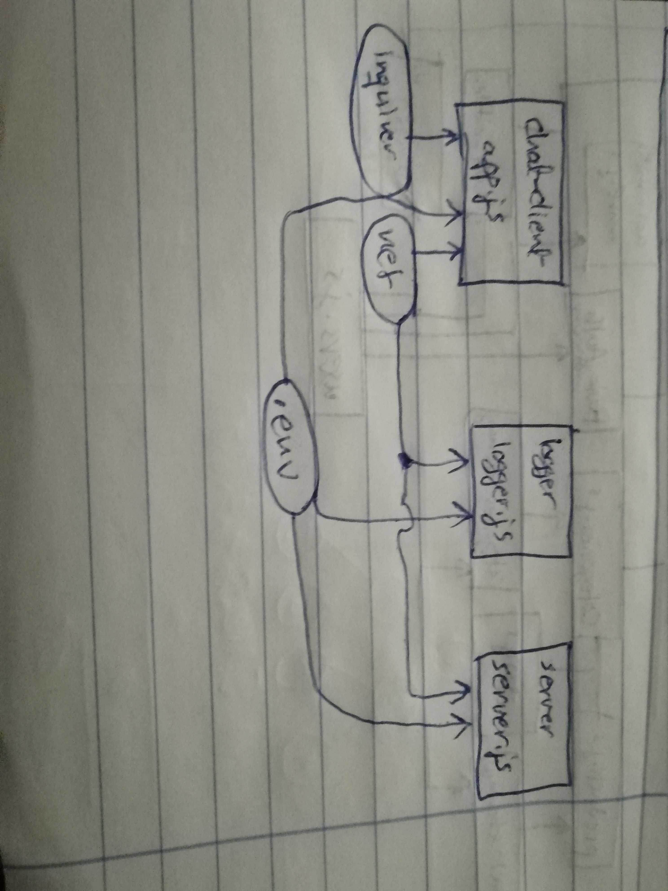

# LAB - Class 15

## TCP Server Message Application

### Author: Ahmad K. Al-Mahasneh

### Links and Resources

- [submission PR]()

#### `.env` requirements
- `PORT` - 3001

#### Worked as a group
  - Ahmad K. Al-Mahasneh
  - Qusai A. Al-Hanaktah
  - Mohammad S. Al-Hawamdeh
  - Ayman J. Al-Khawaldeh

#### UML

